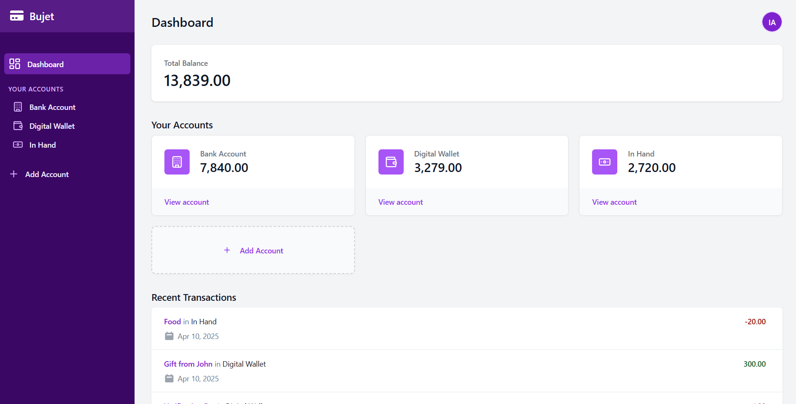

# Bujet
Bujet is a simple and intuitive finance tracking app.

Featuring:

- 🖥️ **Simple and intuitive user interface**
- 💵 **Convenient accounts management and transactions logging**
- 📊 **Summary and insights of financial details**
- ... and much more!

Bujet is a **self hosted app** which means the server, databases, and frontend are
all ran and managed at user's local machine.

## Installation
Bujet can be installed in two ways:

1. Automatic Installation - recommended for running Bujet locally.
2. Manual Installation - recommended for deployments on cloud servers.

First, download and install **[Git](https://git-scm.com/downloads)** and after installation, open command line and run the following command:

```bash
$ git clone --recurse-submodules https://github.com/izxxr/bujet.git
```

All the files be cloned in `bujet` directory. Use `cd bujet` to navigate to this directory for the next installation steps.

> ℹ️ Bujet uses Git submodules to manage server and client source code in a single repository. The client or frontend code is kept as a submodule. For this reason, we are passing `--recurse-submodules` to `clone` command. Without this option, the frontend submodule is not cloned.
>
> For the same reason, it is not recommended to download ZIP file directly from GitHub. If you are still doing it, you will have to manually download the frontend files from [this repository](https://github.com/izxxr/bujet-client) and paste them in `frontend` directory.

## Dependencies
Bujet requires [Node.JS v22 or higher](https://nodejs.org/en/download) and [Python 3.9 or higher](https://python.org/downloads) for running.


After these tools are installed, in the downloaded directory, open command prompt or any available terminal and run the following commands:

Install Python dependencies:

```sh
$ python -m pip install -r requirements.txt
```

## Automatic Installation
Bujet comes bundled with an automatic installation tool that sets up Bujet with a single command. This tool is
used for local hosting only.

> ⚠️ Automatic installation using `-I` flag is intended for local hosting only. The auto installer provided by Bujet uses installation methods that are only safe in a local environment. If you intend to deploy Bujet on a cloud server, please read manual installation section.

In the downloaded directory, run the `python autorun.py -I` command:

```bash
$ python autorun.py -I
```

For the subsequent prompt, enter `Y` to confirm installation. The auto installation tool will install and setup required tools.

After installation is done, run Bujet server using:

```bash
$ python autorun.py
```

**Start using Bujet at [http://localhost:5000](http://localhost:5000) 🚀**

## Manual Installation
In case you intend to deploy Bujet on cloud or automatic installation does not work for any reason, you can install Bujet manually.

### Encryption Key
Bujet uses `cryptography.Fernet` for encrypting sensitive credentials. This requires an encryption key to be provided through `BUJET_ENCRYPTION_KEY` environment variable.

To generate a key, run the following command:

```bash
$ python autorun.py --gen-key
```

Copy the resulting encryption key and create an `.env` file in the directory containing autorun.py file with following content:

```bash
BUJET_ENCRYPTION_KEY="paste encryption key here"
```

### Setting up Frontend
The frontend needs to be setup using npm.

First, install the required packages navigate to `frontend` directory:

```bash
$ cd frontend
```

Run the following command to install required packages:

```bash
$ npm i --production=false
```

In order to build the frontend, run the following command:

```bash
$ npm run build
```

The frontend will be built in `dist` directory.

## API Base URL
By default, Bujet runs backend server at https://localhost:8000 which is the default base URL for the API.

If you are hosting the API using an external service, you might want to provide an alternative `BUJET_SERVER_BASE_URL` environment variable for frontend:

```bash
BUJET_SERVER_BASE_URL="https://bujetapi.myhosting.com"
```

Now, frontend will perform all its request against this base URL.

### Running
After steps above are done, navigate back to the downloaded directory and run Bujet server using:

```bash
$ python autorun.py
```

**Start using Bujet at [http://localhost:5000](http://localhost:5000) 🚀**

## Contributing
All contributions are welcomed whether in the form of issues (for reporting bugs or suggesting features) or making code changes via pull requests.
